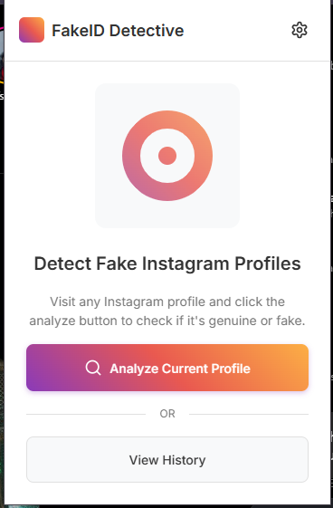
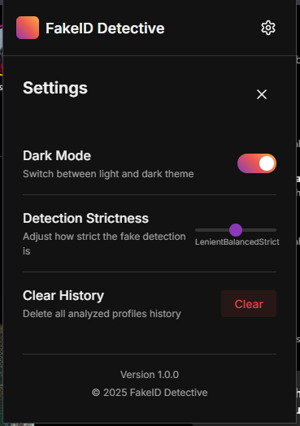
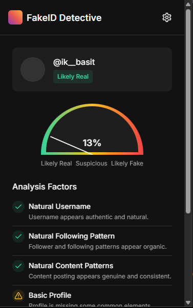

# Instagram Fake ID Detector


An AI-powered Chrome Extension designed to **detect fake Instagram profiles** effortlessly.  
This lightweight tool analyzes Instagram user information and flags suspicious or fake accounts — saving you time and protecting you from scams.

---

## 🚀 Features
- 🔍 Scan Instagram profiles directly from your browser.
- 🤖 AI-powered fake profile detection.
- ⚡ Fast and lightweight — no noticeable browser slowdown.
- 🛡️ 100% Privacy — No user data is collected or shared.

---

## 🛠 Installation

1. Clone or download this repository:
   ```bash
   git clone https://github.com/Abbas2003/Fake-ID-detective.git
   ```

2. Open [chrome://extensions/](chrome://extensions/) in your browser.

3. Enable **Developer Mode** (top right corner).

4. Click **"Load unpacked"** and select the project folder.

5. The extension will be installed and ready to use!

---

## 🗂 Project Structure
| File/Folder | Description |
|:------------|:------------|
| `manifest.json` | Extension metadata and permissions configuration (Manifest V3). |
| `service worker` | Background script to manage extension activities. |
| `icons/` | Icons for different extension sizes (16x16, 48x48, 128x128). |
| `popup.html` | User interface popup for the extension (if available). |
| `scripts/` | Core logic for detecting fake profiles. |

---

## 📦 Manifest Overview

- **Manifest Version:** 3
- **Permissions:** 
  - Access to Instagram pages.
  - Service worker for background processing.

---

## 🛡️ Privacy Policy

- We respect your privacy.  
- No personal data, browsing history, or account credentials are collected, stored, or transmitted by this extension.

---

## 📸 Screenshots

| Preview |
|:-------:|
| 
| 
| 
---

## 🧑‍💻 Author

**Abbas**  
[GitHub Profile](https://github.com/Abbas2003)

---

## 🤝 Contributions

Contributions, issues, and feature requests are welcome!  
Feel free to open a pull request.

---

## ⭐ Support

If you find this project helpful, don't forget to ⭐ the repository!

---

